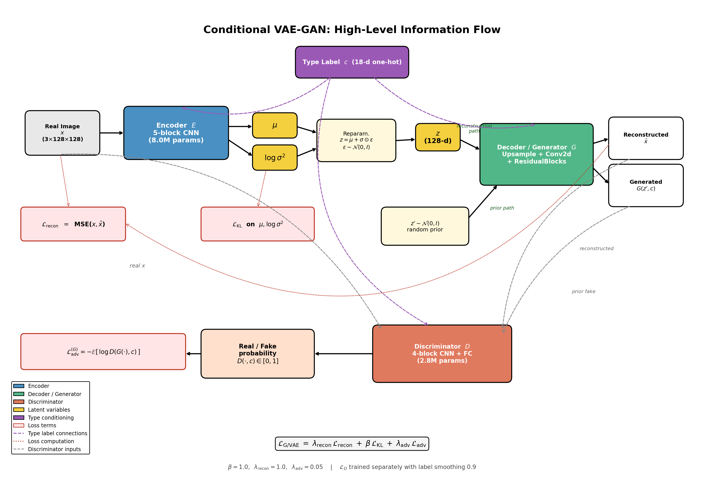
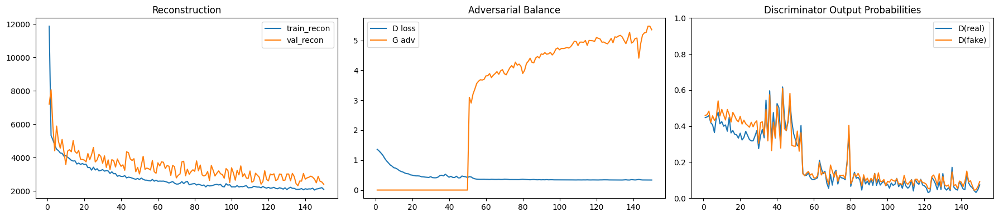
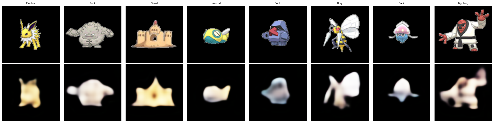
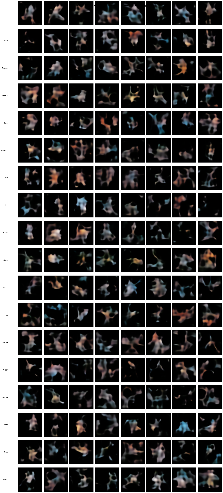
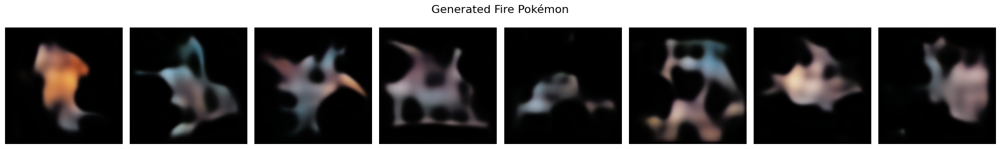

# Pokemon Generation using Conditional VAE-GAN

**Course:** 204466 Deep Learning — Final Project
**Topic:** Type-Conditional Pokemon Image Generation
**GitHub Repository:** [https://github.com/woraamy/Pokemon-Generator-VAE](https://github.com/woraamy/Pokemon-Generator-VAE)

---

## 1. Final Project Topic

This project builds a **deep generative model that creates novel Pokemon images conditioned on a chosen elemental type** (Fire, Water, Grass, Electric, etc.). The system is a hybrid **Conditional Variational Autoencoder + Generative Adversarial Network (Conditional VAE-GAN)** trained on the Kaggle Pokemon Images and Types Dataset.

The trained model can:
- Generate previously unseen creature designs of a chosen type from random noise
- Reconstruct existing Pokemon through the VAE pathway
- Produce variations that share type-specific visual characteristics (color palette, silhouette tendencies)

---

## 2. Why is this topic interesting?

Generative AI is one of the most rapidly evolving subfields of deep learning, with diffusion models and GANs powering systems like Stable Diffusion, DALL·E, and Midjourney. Building a generative model from scratch — instead of fine-tuning a foundation model — provides a much deeper understanding of how these systems actually work, what they fail at, and why.

Pokemon were chosen as the target domain for several reasons:

- **Rich visual diversity within a constrained design language.** Pokemon span 18 distinct elemental types, each with a recognizable visual identity (fire types skew toward warm reds and oranges; water types toward blues; grass types toward greens). This gives the model meaningful structure to learn while keeping the domain bounded.
- **Conditional generation is genuinely useful.** Unconditional generation produces random outputs the user cannot steer. By conditioning on type, the system gains *controllable creativity* — a user requests a "fire Pokemon" and the model generates one. This mirrors how real-world generative tools (text-to-image, style-conditioned generation) work.
- **Tractable scale.** With ~800 images, the dataset is small enough to train on a single Colab T4 GPU within reasonable time, but large enough that the problem is non-trivial (and small enough to expose the genuine difficulty of generative modeling, which we encountered repeatedly).
- **Wide input-to-output ratio.** A 128-dimensional latent vector + 18-dimensional type one-hot must produce a 128 × 128 × 3 = 49,152-pixel image. Bridging this compression gap meaningfully is exactly the kind of problem that deep learning is uniquely well-suited to.

---

## 3. Why does this topic require deep learning?

### Comparison with non-deep-learning approaches

| Approach | How it works | Why it fails for this problem |
|---|---|---|
| **Hand-coded rules / procedural generation** | Designer encodes rules: "fire types must have flame elements, red/orange palette, sharp shapes" | Cannot capture the implicit visual style that makes something *look like a Pokemon* rather than a generic monster. Requires extensive manual art-direction. |
| **Template assembly / asset mixing** | Combine pre-drawn body parts (head, tail, limbs) with palette swaps | Output limited to recombinations of existing parts; cannot invent novel shapes. Requires a manually-built asset pipeline. |
| **Classical statistical methods (PCA, GMM)** | Model pixel distributions with Gaussian mixtures or principal components | Cannot model nonlinear, high-dimensional dependencies between pixels. Outputs are blurry global averages. |
| **Nearest-neighbor retrieval** | "Generate" by retrieving the closest existing Pokemon to a query | Not actually generative — only returns existing data. No interpolation, no novelty. |

### Why deep learning is the appropriate tool

Image generation requires modeling a probability distribution over the 49,152-dimensional space of valid pixel arrays, conditioned on a low-dimensional type label. This distribution is:

- **Highly nonlinear** — small changes to a noise vector should produce smooth, structured changes in the output image.
- **Multi-modal** — there are many valid "fire Pokemon" that look very different from each other.
- **High-dimensional** — pixel-space dependencies span the entire image (a fire pattern in the corner relates to body shape, color palette, and posture elsewhere).

Convolutional neural networks are uniquely suited because they (i) compose nonlinear transformations to model arbitrary distributions, (ii) share weights spatially, allowing efficient learning from limited data, and (iii) can be combined with adversarial training to produce sharper, more realistic outputs.

### Strengths and weaknesses of the deep learning approach

**Strengths**
- Learns visual style implicitly from data, no manual rules required
- Smooth latent space enables interpolation and controllable generation
- Conditional inputs steer outputs without retraining
- Same framework scales to higher resolutions and larger datasets

**Weaknesses**
- Requires substantial training data; ~800 images is on the lower edge for image generation
- Vanilla VAEs produce blurry outputs (a known consequence of pixel-wise reconstruction loss against a Gaussian latent prior)
- GANs are notoriously unstable and require careful hyperparameter tuning
- Black-box behavior — failure modes are hard to predict from architecture alone, leading to extensive trial-and-error (as documented in our six experiments below)
- Computationally expensive compared to classical methods

---

## 4. Deep Learning Architecture

The model is a **Conditional VAE-GAN** consisting of three sub-networks: an Encoder (E), a Decoder/Generator (G), and a Discriminator (D). The encoder and decoder together form the conditional VAE; the decoder doubles as the generator for the adversarial component.

### 4.1 High-level information flow


Two losses act on the decoder:
- **Reconstruction-pathway**: x → E → z → G(z, c) → x̂ (reconstructed). Gives the VAE its reconstruction loss.
- **Prior-pathway**: z' ~ N(0, I) → G(z', c). Gives the discriminator a second source of "fake" samples to evaluate against.

### 4.2 Encoder (E)

5-block CNN that maps a 128×128×3 image plus a type one-hot to the parameters of the approximate posterior q(z | x, c).

| # | Operation | Output shape | Activation |
|---|---|---|---|
| 0 | Input image (normalized to [-1, 1]) | [B, 3, 128, 128] | — |
| 1 | Conv2d(3→32, 4×4, stride 2, pad 1) + BN(32) | [B, 32, 64, 64] | LeakyReLU(0.2) |
| 2 | Conv2d(32→64, 4×4, stride 2, pad 1) + BN(64) | [B, 64, 32, 32] | LeakyReLU(0.2) |
| 3 | Conv2d(64→128, 4×4, stride 2, pad 1) + BN(128) | [B, 128, 16, 16] | LeakyReLU(0.2) |
| 4 | Conv2d(128→256, 4×4, stride 2, pad 1) + BN(256) | [B, 256, 8, 8] | LeakyReLU(0.2) |
| 5 | Conv2d(256→512, 4×4, stride 2, pad 1) + BN(512) | [B, 512, 4, 4] | LeakyReLU(0.2) |
| 6 | Flatten | [B, 8192] | — |
| 7 | Concatenate type one-hot (18-d) | [B, 8210] | — |
| 8a | Linear(8210 → 128) | [B, 128] = μ | linear |
| 8b | Linear(8210 → 128) | [B, 128] = log σ² | linear |

### 4.3 Reparameterization

The latent code is sampled differentiably via:

z = μ + σ ⊙ ε,    where σ = exp(0.5 · log σ²) and ε ~ N(0, I)

This trick allows gradients to flow through the sampling operation, which is essential for end-to-end training.

### 4.4 Decoder / Generator (G)

Maps a latent code z and type one-hot c to a 128×128×3 image. Uses **Upsample + Conv2d** combinations rather than transposed convolutions to avoid checkerboard artifacts, with two **Residual Blocks** at the 128- and 64-channel feature maps to refine fine-grained details.

| # | Operation | Output shape | Activation |
|---|---|---|---|
| 0 | Concat z (128) + type (18) | [B, 146] | — |
| 1 | Linear(146 → 8192) | [B, 8192] | — |
| 2 | Reshape | [B, 512, 4, 4] | — |
| 3 | Upsample(×2, nearest) + Conv2d(512→256, 3×3) + BN(256) | [B, 256, 8, 8] | LeakyReLU(0.2) |
| 4 | Upsample(×2, nearest) + Conv2d(256→128, 3×3) + BN(128) | [B, 128, 16, 16] | LeakyReLU(0.2) |
| 5 | **ResidualBlock(128)**: two Conv3×3 + BN with skip | [B, 128, 16, 16] | LeakyReLU(0.2) |
| 6 | Upsample(×2, nearest) + Conv2d(128→64, 3×3) + BN(64) | [B, 64, 32, 32] | LeakyReLU(0.2) |
| 7 | **ResidualBlock(64)**: two Conv3×3 + BN with skip | [B, 64, 32, 32] | LeakyReLU(0.2) |
| 8 | Upsample(×2, nearest) + Conv2d(64→32, 3×3) + BN(32) | [B, 32, 64, 64] | LeakyReLU(0.2) |
| 9 | Upsample(×2, nearest) + Conv2d(32→3, 3×3) | [B, 3, 128, 128] | **Tanh** |

The Tanh activation produces outputs in [-1, 1], matching the input normalization range.

### 4.5 Conditional Discriminator (D)

A standard convolutional classifier that evaluates whether a given (image, type) pair came from the real dataset or was generated. The type label is broadcast across spatial dimensions and concatenated as additional input channels — this is how conditional GANs typically inject class information.

| # | Operation | Output shape | Activation |
|---|---|---|---|
| 0 | Image + tiled type map (3 + 18 channels) | [B, 21, 128, 128] | — |
| 1 | Conv2d(21→64, 4×4, stride 2, pad 1) | [B, 64, 64, 64] | LeakyReLU(0.2) |
| 2 | Conv2d(64→128, 4×4, stride 2, pad 1) + BN(128) | [B, 128, 32, 32] | LeakyReLU(0.2) |
| 3 | Conv2d(128→256, 4×4, stride 2, pad 1) + BN(256) | [B, 256, 16, 16] | LeakyReLU(0.2) |
| 4 | Conv2d(256→512, 4×4, stride 2, pad 1) + BN(512) | [B, 512, 8, 8] | LeakyReLU(0.2) |
| 5 | AdaptiveAvgPool2d(1) | [B, 512, 1, 1] | — |
| 6 | Flatten + Linear(512 → 1) | [B, 1] = logit | linear (BCEWithLogitsLoss applied) |

### 4.6 Loss functions

The total VAE-GAN loss combines three terms, with the adversarial term activated only after a 50-epoch warmup period:

**Reconstruction loss** (MSE between input and reconstruction):
L_recon = ||x - G(E(x), c)||² (summed per pixel, averaged per batch)

**KL divergence** (regularizes latent toward standard Gaussian):
L_KL = -½ Σᵢ (1 + log σᵢ² - μᵢ² - σᵢ²)

**Generator adversarial loss** (combined over reconstruction-pathway and prior-pathway samples):
L_adv = ½ [BCE(D(x̂, c), 1) + BCE(D(G(z', c), c), 1)]

**Total VAE/Generator loss:**
L_G = λ_recon · L_recon + β · L_KL + λ_adv · L_adv

**Discriminator loss** (with label smoothing on real targets):
L_D = BCE(D(x, c), 0.9) + ½ [BCE(D(x̂, c), 0) + BCE(D(G(z', c), c), 0)]

### 4.7 Parameter counts

| Component | Parameters |
|---|---|
| Conditional VAE (Encoder + Decoder) | **8,034,851** |
| Conditional Discriminator | **2,777,281** |
| **Total trainable** | **10,812,132** |

---

## 5. Code Explanation

The complete implementation is in [`notebook/main_model.ipynb`](https://github.com/woraamy/Pokemon-Generator-VAE/blob/main/notebook/main_model.ipynb). The notebook is organized into the following sections, each handling a specific responsibility.

### 5.1 Configuration block (handles all hyperparameters)

A single `CONFIG` dictionary at the top of the notebook holds every hyperparameter, making experiments fully reproducible:

```python
CONFIG = {
    "kaggle_dataset": "kvpratama/pokemon-images-dataset",
    "seed": 42,
    "name": "baseline_vaegan",
    "img_size": 128,
    "latent_dim": 128,
    "beta": 1.0,
    "lr": 1e-3,
    "loss_type": "mse",
    "epochs": 150,
    "d_lr": 5e-5,
    "lambda_recon": 1.0,
    "lambda_adv": 0.05,
    "label_smoothing": 0.9,
    "batch_size": 32,
    "val_ratio": 0.1,
    "warmup_epochs": 50,
    # augmentation params...
}
```

### 5.2 Data handling (the data pipeline)

The dataset comes from Kaggle and is fetched programmatically through `kagglehub`:

```python
path = kagglehub.dataset_download("vishalsubbiah/pokemon-images-and-types")
```

The data pipeline then:

1. **Builds a metadata mapping** from each Pokemon name (CSV column `Name`) to its image file by normalizing names (lowercase, alphanumeric only).
2. **Builds the type vocabulary** from the `Type1` column (18 distinct types, mapped to integer indices).
3. **Defines `PokemonDataset`** — a custom `torch.utils.data.Dataset` subclass that opens each image, converts to RGB, applies the augmentation pipeline, and returns a tuple `(image, type_one_hot, type_idx)`.
4. **Splits 90/10 train/val** using `random_split` with a fixed seed for reproducibility (729 train / 80 validation).
5. **Wraps in DataLoaders** with batch size 32, shuffled for training, ordered for validation.

The training augmentation pipeline includes random resized crop, horizontal flip, rotation, affine transform, color jitter, and random erasing. Validation uses only resize + normalize.

### 5.3 Model creation (the architectures)

Three classes are defined in this section:

- **`ResidualBlock`** — implements `y = LeakyReLU(x + Conv-BN-LeakyReLU-Conv-BN(x))`, used inside the decoder to refine high-resolution features without losing information across layers.
- **`ConditionalVAE`** — packages the encoder, reparameterization, and decoder into a single module. Type conditioning is injected by concatenating the type one-hot to the flattened encoder features (for q(z|x,c)) and to z directly (for p(x|z,c)). The forward pass is:
    ```python
    def forward(self, x, c):
        mu, logvar = self.encode(x, c)
        z = self.reparameterize(mu, logvar)
        recon = self.decode(z, c)
        return recon, mu, logvar
    ```
- **`ConditionalDiscriminator`** — a CNN classifier. The type one-hot is reshaped to `(B, 18, 1, 1)` and broadcast (`expand`) to match the spatial size, then concatenated channel-wise to the input image. This way, the discriminator's first convolution sees both the image content *and* the conditioning, allowing it to detect type-mismatched fakes.

### 5.4 Training (the training loop)

Training uses two separate Adam optimizers — one for the VAE (lr = 1e-3) and one for the discriminator (lr = 5e-5). Each batch executes the following two-step update:

**Step 1 — Train discriminator:**
```python
with torch.no_grad():
    recon, _, _ = vae(imgs, c)                # reconstructed fakes
    z = torch.randn(bs, latent_dim, device=device)
    prior_fake = vae.decode(z, c)             # prior-sampled fakes

real_logits = disc(imgs, c)
fake_logits_recon = disc(recon.detach(), c)
fake_logits_prior = disc(prior_fake.detach(), c)

# Real labels smoothed to 0.9 for stability
d_loss = bce_logits(real_logits, 0.9) + 0.5 * (
    bce_logits(fake_logits_recon, 0) +
    bce_logits(fake_logits_prior, 0)
)
opt_d.step()
```

**Step 2 — Train VAE/Generator:**
```python
recon, mu, logvar = vae(imgs, c)
z = torch.randn(bs, latent_dim, device=device)
prior_fake = vae.decode(z, c)

recon_loss, kl_loss = vae_recon_kl_loss(recon, imgs, mu, logvar, "mse")

if epoch < CONFIG["warmup_epochs"]:
    adv_loss = 0   # pure VAE for first 50 epochs
else:
    adv_loss = 0.5 * (
        bce_logits(disc(recon, c), 1) +
        bce_logits(disc(prior_fake, c), 1)
    )

g_loss = (CONFIG["lambda_recon"] * recon_loss
          + CONFIG["beta"] * kl_loss
          + CONFIG["lambda_adv"] * adv_loss)
opt_vae.step()
```

Two key design decisions:

1. **50-epoch warmup**: training as a pure VAE for the first 50 epochs lets the encoder/decoder establish a meaningful latent space *before* the discriminator starts pushing the generator. Without this, we observed that the discriminator quickly overpowers a randomly-initialized generator, preventing the VAE from learning useful representations at all.
2. **Two adversarial pathways**: the discriminator evaluates both reconstructed fakes (E→G) and prior-sampled fakes (z'→G). This ensures the adversarial signal applies to both modes of generation.

After each epoch, validation metrics are computed and the checkpoint with lowest `val_total = val_recon + β · val_kl` is saved.

### 5.5 Evaluation and visualization

After training, the notebook produces:

- **Loss curves**: train/val reconstruction loss, D-loss vs G-adversarial loss, and discriminator output probabilities D(real) vs D(fake) over time.
- **Reconstruction grid** (`show_reconstructions`): real Pokemon from the validation set alongside their VAE reconstructions, demonstrating the encoder/decoder pair captures the input.
- **Generated samples per type** (`generate_by_type`): an 18-row × 8-column grid where each row contains 8 samples generated by sampling z ~ N(0, I) and conditioning on a different type.
- **Type-specific generation** (`generate_pokemon`): a focused function that takes a type name (e.g., `"Fire"`) and generates n samples for that type only.

---

## 6. GitHub Repository

Full source code, the trained notebook, dataset, and all output figures are publicly available at:

**https://github.com/woraamy/Pokemon-Generator-VAE**

Repository structure:
- `notebook/main_model.ipynb` — the complete training and evaluation notebook
- `dataset/` — Pokemon image data and metadata
- `output/` — generated samples, reconstruction grids, training curves
- `README.md` — this report in markdown format

---

## 7. Training Method and Dataset

### Dataset

**Source:** [Pokemon Images and Types](https://www.kaggle.com/datasets/vishalsubbiah/pokemon-images-and-types) on Kaggle, by user `vishalsubbiah`.

**Size:** 809 unique Pokemon images successfully matched to type metadata.

**Format:** PNG images of varying original resolutions, resized to 128 × 128 for training. Each Pokemon is labeled with a primary type (`Type1`).

**Type distribution:** 18 distinct types — Bug, Dark, Dragon, Electric, Fairy, Fighting, Fire, Flying, Ghost, Grass, Ground, Ice, Normal, Poison, Psychic, Rock, Steel, Water.

**Split:** 90% training / 10% validation via random split with fixed seed (42). Resulting in **729 training images / 80 validation images**.

### Preprocessing

- Convert all images to RGB (drops alpha channel)
- Resize to 128 × 128
- Normalize to mean = (0.5, 0.5, 0.5), std = (0.5, 0.5, 0.5), giving outputs in [-1, 1] (matches Tanh decoder output)
- Type encoded as 18-dimensional one-hot vector

### Training augmentation

Applied only on the training split, to combat overfitting on the small dataset:

- `RandomResizedCrop` with scale (0.85, 1.0), aspect ratio (0.9, 1.1)
- `RandomHorizontalFlip` p = 0.5
- `RandomRotation` ±12°
- `RandomAffine` ±15° rotation, ±10% translate, scale (0.9, 1.1)
- `ColorJitter` brightness/contrast/saturation = 0.15, hue = 0.02
- `RandomErasing` p = 0.1, scale (0.02, 0.12)

### Optimization

| Hyperparameter | Value |
|---|---|
| VAE optimizer | Adam, lr = 1 × 10⁻³ |
| Discriminator optimizer | Adam, lr = 5 × 10⁻⁵ |
| Batch size | 32 |
| Total epochs | 150 |
| Warmup epochs (pure VAE, no adversarial) | 50 |
| β (KL divergence weight) | 1.0 |
| λ_recon (reconstruction weight) | 1.0 |
| λ_adv (adversarial weight) | 0.05 |
| Label smoothing on real targets | 0.9 |
| Reconstruction loss type | MSE |
| Hardware | NVIDIA T4 GPU (Google Colab) |

---

## 8. Evaluation

### 8.1 Iterative experimentation (evidence of methodology)

The final architecture and configuration were arrived at through **six progressive experiments**, each motivated by a specific failure mode of the previous one. This iterative process is itself an important finding: it documents the genuine difficulty of small-dataset generative modeling.

#### Experiment 1: Pure Conditional VAE — hyperparameter sweep

Trained four VAE-only configurations to establish a baseline.

| Name | img_size | latent_dim | β | loss | epochs |
|---|---|---|---|---|---|
| baseline | 128 | 128 | 1.0 | MSE | 150 |
| low_beta | 128 | 128 | 0.1 | L1 | 150 |
| larger_latent | 128 | 256 | 0.1 | L1 | 150 |
| high_res | 128 | 256 | 0.01 | MSE | 200 |

**Result:** Reconstructions of real Pokemon were recognizable but soft; *generated* samples (random latents) were blobby and lacked structure across all four configurations. This confirmed the well-known VAE limitation that pixel-wise reconstruction loss against a Gaussian prior produces blurry generations.

#### Experiment 2: Adding a GAN component

Integrated a Conditional Discriminator into the baseline VAE configuration to introduce adversarial sharpness.

```python
"img_size": 128, "latent_dim": 128, "beta": 1.0,
"lr": 1e-3, "d_lr": 5e-4, "lambda_adv": 0.02,
"warmup_epochs": 10, "epochs": 150
```

**Result:** Generated samples gained more vivid color but did not yet form coherent Pokemon shapes — outputs looked like colored cloudy patches scattered against the background.

#### Experiment 3: Lower β, stricter optimization

Lowered β to 0.05, dropped both learning rates, and increased the adversarial weight to λ_adv = 0.2.

```python
"beta": 0.05, "lr": 2e-4, "d_lr": 1e-4, "lambda_adv": 0.2
```

**Result:** Mid-training instability appeared. The reconstruction loss spiked sharply around epoch 130, indicating the discriminator had overpowered the generator. The increased adversarial weight, while sharpening early outputs, ultimately destabilized later training.

#### Experiment 4: Architectural improvements

Replaced strict transposed convolutions in the decoder with Upsample + Conv2d combinations (to reduce checkerboard artifacts) and added two Residual Blocks at the 128- and 64-channel feature maps to refine fine-grained features.

```python
"latent_dim": 256, "beta": 0.005, "lr": 3e-4,
"d_lr": 5e-5, "loss_type": "l1"
```

**Result:** Significantly clearer silhouettes — generated samples started to show recognizable creature outlines, though still lacking fine detail. This was the first experiment where the model produced outputs that looked plausibly Pokemon-shaped.

#### Experiment 5: Aggressive augmentation

Added stronger augmentation to combat overfitting, extended training to 200 epochs, increased warmup to 50 epochs.

**Result:** Quality regressed. The over-aggressive augmentation pipeline (especially adding RandomAffine to an already-augmented input) pushed the model toward learning over-invariance at the cost of detail; outputs became dimmer and less defined. This demonstrated that *more augmentation is not always better* on a small dataset.

#### Experiment 6 (Final): Best architecture + tuned hyperparameters

Reverted to well-tuned hyperparameters from earlier experiments while retaining the improved decoder architecture from Experiment 4 and a moderate augmentation pipeline. This is the configuration in the final notebook:

```python
"img_size": 128, "latent_dim": 128, "beta": 1.0,
"lr": 1e-3, "loss_type": "mse", "epochs": 150,
"d_lr": 5e-5, "lambda_recon": 1.0, "lambda_adv": 0.05,
"label_smoothing": 0.9, "warmup_epochs": 50
```

**Result:** Best output quality of all six experiments. Generated samples are recognizably creature-shaped, with type-appropriate color palettes (warm tones for Fire/Electric, cooler tones for Water/Ice, earthy tones for Ground/Rock). Outputs remain somewhat soft on fine details but resolve into Pokemon-like silhouettes. Reconstructions of real Pokemon retain the source's overall shape and color identity.

### 8.2 Final quantitative results (Experiment 6)

End-of-training validation metrics (epoch 150):

| Metric | Value |
|---|---|
| Validation total loss (recon + β · KL) | **2609.27** |
| Validation reconstruction loss (MSE, sum-per-image) | 2405.68 |
| Validation KL divergence | 203.58 |
| D(real) — average D output on real images | **0.074** |
| D(fake) — average D output on generated images | **0.093** |

**Best checkpoint** (saved by lowest validation total loss): **val_total = 2516.39**

The near-equal D(real) ≈ D(fake) values confirm that adversarial training reached a healthy equilibrium — the discriminator could not reliably distinguish real from generated samples, which is the desired property of a converged GAN.

### 8.3 Training dynamics



Three observations from the curves above:

- **Reconstruction loss** (left panel) decreases smoothly from ~12,000 at epoch 1 to ~2,500 by epoch 150. Validation tracks training closely with a small consistent gap, indicating mild overfitting which is acceptable on a dataset of this size.
- **Adversarial balance** (middle panel) shows the warmup design clearly: G adversarial loss is 0 for the first 50 epochs (pure VAE), then jumps up when the GAN component activates. After epoch 50, D loss stays low and stable while G adversarial loss rises gradually — the discriminator is forcing the generator to produce increasingly convincing outputs.
- **Discriminator output probabilities** (right panel) for real and fake samples track each other closely throughout adversarial training, confirming neither network overpowers the other. This is the desired equilibrium for a GAN — if D(real) had stayed high while D(fake) collapsed to 0, training would have failed.

### 8.4 Qualitative results

#### Validation reconstructions



Real Pokemon are reconstructed with their overall silhouette, color palette, and type-appropriate appearance preserved, though fine details (eyes, sharp edges) are softened. This is the expected VAE-style smoothing — a known consequence of pixel-wise reconstruction loss combined with the KL regularizer. Importantly, the reconstructions are clearly *individual* — the Jolteon (Electric, leftmost) reconstruction shares its yellow palette and pointed posture, while the sandcastle Ghost reconstruction preserves the symmetric architectural shape.

#### Type-conditioned generation (samples per type)



Each row shows 8 samples generated from random latent codes z ~ N(0, I) conditioned on a different type. Observe the type-specific characteristics:

- **Fire**: warm reds, oranges, and pinks
- **Water**: cooler blues and grays
- **Grass**: greens and yellows mixed with earthy tones
- **Electric**: bright yellows and warm contrasts
- **Ice**: pale blues and whites
- **Ghost**: muted, ethereal palettes

Shapes vary meaningfully across samples within a single type, indicating the model captured intra-type diversity rather than collapsing to a single mode.

#### Type-specific generation (Fire)



A focused generation of 8 Fire-type samples shows distinct creature silhouettes with consistent warm color palettes — orange, red, and brown tones — while varying in posture and shape across the batch.

### 8.5 Honest discussion of limitations

The generated samples remain somewhat blurry and lack the fine detail of the original Pokemon artwork. This is consistent with the well-documented VAE-GAN reconstruction-vs-generation tradeoff and is influenced by several factors:

1. **Small dataset.** With only ~800 images split across 18 types, each type has on average ~45 examples — a very small training signal per condition.
2. **Pixel-wise reconstruction loss.** MSE loss is minimized by predicting the conditional mean over plausible reconstructions, which manifests as blur. Sharpness can be improved using perceptual losses (e.g., VGG-feature distances) — noted as future work.
3. **Adversarial weight (λ_adv = 0.05) is conservative.** Higher adversarial weight produces sharper outputs but, as shown in Experiment 3, destabilizes training. The chosen value prioritizes stability.
4. **Resolution (128×128).** Higher resolutions would allow more detail but require either more data or careful progressive growing (e.g., StyleGAN-style). Both are out of scope for the project timeline.

Despite these limitations, the system successfully demonstrates the core capability: type-conditioned generation of plausible Pokemon-shaped creatures with consistent type-aligned color palettes. The progression across six experiments is itself a demonstration of the experimental methodology required for generative modeling.

---

## 9. References and Related Work

1. Kingma, D. P., & Welling, M. (2013). **Auto-Encoding Variational Bayes.** *arXiv preprint arXiv:1312.6114.* — The foundational VAE paper introducing the reparameterization trick and ELBO objective.

2. Goodfellow, I., et al. (2014). **Generative Adversarial Networks.** *Advances in Neural Information Processing Systems.* — Introduced the adversarial training paradigm used in the discriminator component.

3. Larsen, A. B. L., Sønderby, S. K., Larochelle, H., & Winther, O. (2016). **Autoencoding Beyond Pixels Using a Learned Similarity Metric.** *International Conference on Machine Learning.* — Proposed VAE-GAN hybrids, the architectural basis for our model.

4. Sohn, K., Lee, H., & Yan, X. (2015). **Learning Structured Output Representation using Deep Conditional Generative Models.** *Advances in Neural Information Processing Systems.* — Introduced Conditional VAEs (cVAE), the basis for type-conditioning.

5. Mirza, M., & Osindero, S. (2014). **Conditional Generative Adversarial Nets.** *arXiv preprint arXiv:1411.1784.* — Introduced Conditional GANs and the channel-broadcast conditioning technique used in our discriminator.

6. He, K., Zhang, X., Ren, S., & Sun, J. (2016). **Deep Residual Learning for Image Recognition.** *CVPR.* — Source of the residual block architecture used in the decoder.

7. Odena, A., Dumoulin, V., & Olah, C. (2016). **Deconvolution and Checkerboard Artifacts.** *Distill.* — Motivated our decision (Experiment 4) to replace transposed convolutions with Upsample + Conv2d.

8. Salimans, T., Goodfellow, I., Zaremba, W., et al. (2016). **Improved Techniques for Training GANs.** *NeurIPS.* — Source of label smoothing technique used in the discriminator.

9. **Pokemon Images and Types Dataset** (vishalsubbiah). Kaggle. https://www.kaggle.com/datasets/vishalsubbiah/pokemon-images-and-types

10. **Pokemon Images Dataset** (kvpratama). Kaggle. https://www.kaggle.com/datasets/kvpratama/pokemon-images-dataset — referenced in the configuration alongside the primary dataset.

---

## 10. Group Contributions

| Member | Contribution Areas | Percentage |
|---|---|---|
| Worawalan Chatlatanagulchai | First model architecture design, training pipeline implementation, Documentation Writing | 50% |
| Napasorn Tevarut | Improving training pipeline and architecture by doing experiments, Model validation | 50% |
| **Total** | | **100%** |

---
